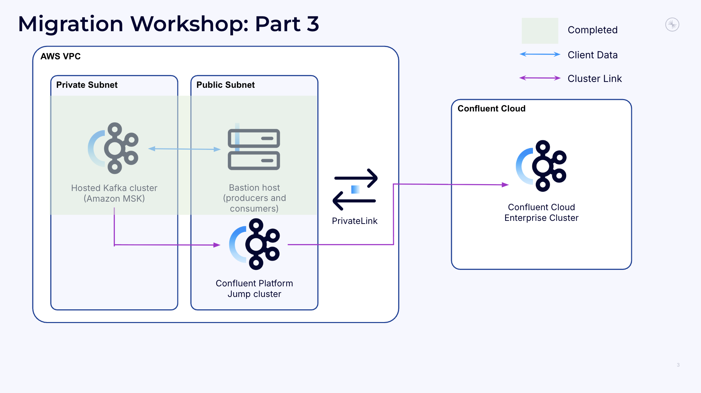
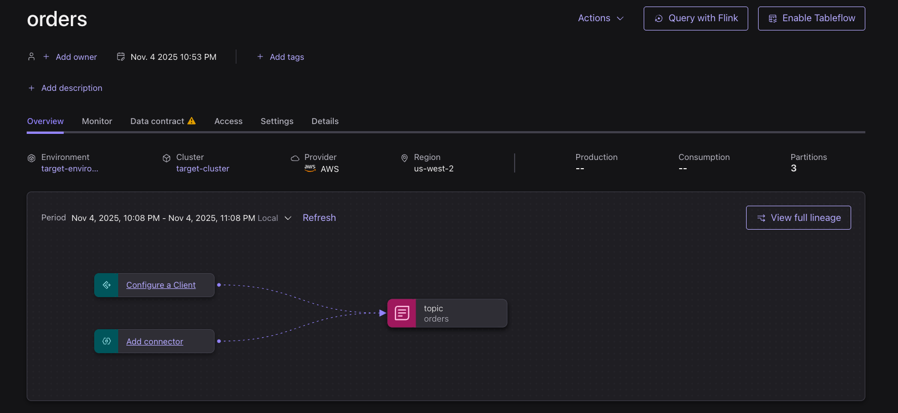

## Part 3 - Provision Migration Resources with KCP CLI

In this section, you will use the Confluent KCP CLI to provision all necessary migration infrastructure and establish Cluster Links between MSK and Confluent Cloud. Because the source cluster is a private MSK cluster, you will need to use a **jump cluster** as an intermediate step between your source cluster and the target Confluent Cloud Enterprise Cluster. This also means that you will need two Cluster Link configurations - one from your source cluster to the Confluent Platform jump cluster, and another from the jump cluster to the Confluent Cloud Enterprise Cluster. 

Creating all of this infrastructure manually can be complex and time consuming. Luckily, the KCP CLI automates creation of all of the infrastructure and networking components required.



### Requirements

Complete [Part 2: Set Up and Test Client Applications](../PART-2/README.md) before starting Part 3. 

### Scan your AWS resources 
1. Navigate to your home directory on your bastion host: 
   ```bash
   cd ~/
   ```

2. Set the environment variables for your AWS role. Make sure to enter your own values for `<YOUR_AWS_ACCESS_KEY_ID>`, `<YOUR_AWS_SECRET_ACCESS_KEY>`, and `<YOUR_AWS_SESSION_TOKEN>`. 
    ```bash
    export AWS_ACCESS_KEY_ID="<YOUR_AWS_ACCESS_KEY_ID>"
    export AWS_SECRET_ACCESS_KEY="<YOUR_AWS_SECRET_ACCESS_KEY>"
    export AWS_SESSION_TOKEN="<YOUR_AWS_SESSION_TOKEN>"
    ```

3. Use the KCP CLI to scan your AWS region for Kafka resources and generate a report. If you changed the default region, you use the region where all of your workshop resources are deployed, for example, `us-west-2`: 
   ```bash
   kcp discover --region us-west-2
   ```

   This command generates two files (`kcp-state.json` and `cluster-credentials.yaml`) that contain information about your MSK resources in your chosen AWS region. You should see the a cluster called `msk-migration-cluster` in the output. Copy its `Cluster ARN` value for use in the next step. 

4. Add your cluster credentials to the `cluster-credentials.yaml` file. 
   ```bash
   nano cluster-credentials.yaml
   ```

   Enter the MSK cluster SASL username ("msk-user") and password ("ChangeMe123!") into the appropriate fields in the `cluster-credentials.yaml` file and save it. 

5. Use the KCP CLI to perform a cluster-level scan on your source cluster: 
   ```bash
   kcp scan clusters \
   --state-file kcp-state.json \
   --credentials-file cluster-credentials.yaml
   ```

### Create the migration infrastructure 
1. Run the following command to create the migration infrastructure Terraform. Make sure to substitute in your own values for `<YOUR_VPC_ID>`: 
   ```bash 
   kcp create-asset migration-infra \
   --state-file kcp-state.json \
   --cluster-arn <YOUR_CLUSTER_ARN> \
   --type 2 \
   --cc-env-name target-environment \
   --cc-cluster-name target-cluster \
   --cc-cluster-type enterprise \
   --ansible-control-node-subnet-cidr 10.0.80.0/24 \
   --jump-cluster-broker-subnet-config us-west-2a:10.0.10.0/24,us-west-2b:10.0.20.0/24,us-west-2c:10.0.30.0/24
   ```

2. Navigate to the newly-created `migration_infra` directory and create the infrastructure with terraform: 
   ```bash 
   cd migration_infra
   terraform init
   terraform apply --auto-approve
   ```

4. When prompted, enter your Confluent Cloud API Key details (f you don't have a Confluent Cloud API Key, see the [Workshop Introduction](../README.md) prerequisites) and SASL username ("msk-user") and password ("ChangeMe123!") for the MSK cluster. Terraform will begin deploying the necessary resources. 

Once you've done this, you can navigate to the [Confluent Cloud Console](http://confluent.cloud/go/cluster) and view your newly-created target resources. 


5. After the terraform deployment completes successfully, you need to add the newly-created **cluster API key** to your `env.cc` file. First, get the API key and secret from the terraform output:
   ```bash
   terraform output confluent_cloud_cluster_bootstrap_endpoint
   terraform output confluent_cloud_cluster_api_key
   terraform output confluent_cloud_cluster_api_key_secret
   ```

6. Navigate to your clients directory and update the `env.cc` file with the cluster API credentials:
   ```bash
   cd ~/clients
   nano env.cc
   ```

7. Replace the placeholder values in your `env.cc` file with the actual cluster API credentials from the terraform output:
   ```bash
   # Confluent Cloud Environment Configuration
   export KAFKA_ENV=cc
   export CC_BOOTSTRAP_SERVERS="<BOOTSTRAP_SERVER_ENDPOINT>"
   export CC_API_KEY="<CLUSTER_API_KEY>"
   export CC_API_SECRET="<CLUSTER_API_SECRET>"
   ```

### Create and run the migration scripts
1. Run the following command to create the migration scripts: 
   ```bash
   cd ~/
   kcp create-asset migrate-topics \
   --state-file kcp-state.json \
   --cluster-arn <YOUR_CLUSTER_ARN> \
   --migration-infra-folder migration_infra
   ```

2. Navigate to the new `migrate_topics` folder and run the scripts:
   ```bash 
   cd migrate_topics
   ./msk-to-cp-mirror-topics.sh
   ```

   Wait for this to finish, then run: 
   ```bash 
   ./cp-to-cc-mirror-topics.sh
   ```

   These scripts establish your Cluster Links and begin mirroring your topics for you. As a reminder, since the source MSK cluster is private, you need to first mirror your topics to the Confluent Platform jump cluster using the `msk-to-cp-mirror-topics` script, and then mirror from your jump cluster to the target Confluent Cloud Enterprise Cluster using the `cp-to-cc-mirror-topics` script. 

   You can now navigate to the **Topics** menu inside your cluster in Confluent Cloud and view your orders topic. 

   

   You may notice that topic information is currently limited for this privately-networked Enterprise Cluster. If you want to view more topic-specific details, you can create the reverse proxy in the next section for a more granular view. 


#### Next Steps 

With the help of the KCP CLI, you've now created the entire migration infrastructure, including the jump cluster you need for a private cluster migration to Confluent Cloud, and the target Confluent Cloud Enterprise cluster. You also established the Cluster Links to begin topic mirroring from your MSK cluster to your Confluent Cloud Enterprise Cluster. In the next section, you will cut over your client applications to use the new Confluent Cloud cluster, completing the migration. 

## Topics

**Next topic:** [Part 4: Cutover Client Applications to Confluent Cloud](../PART-4/README.md)

**Previous topic:** [Part 2: Set Up and Test Client Applications](../PART-2/README.md)
