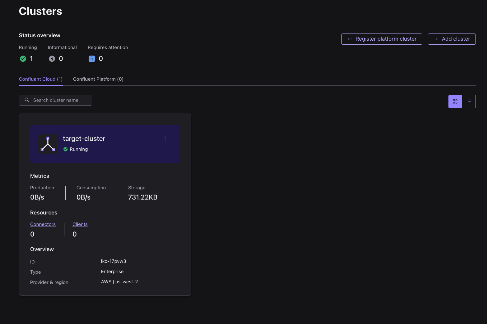
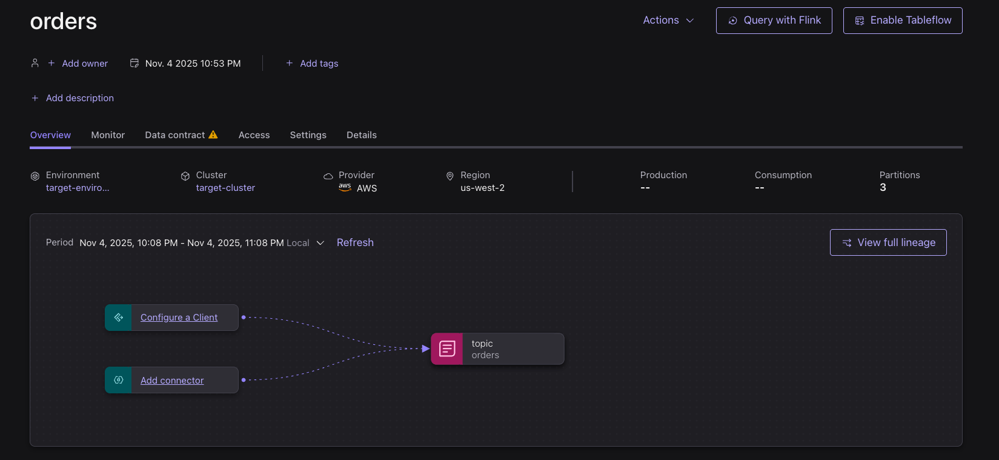
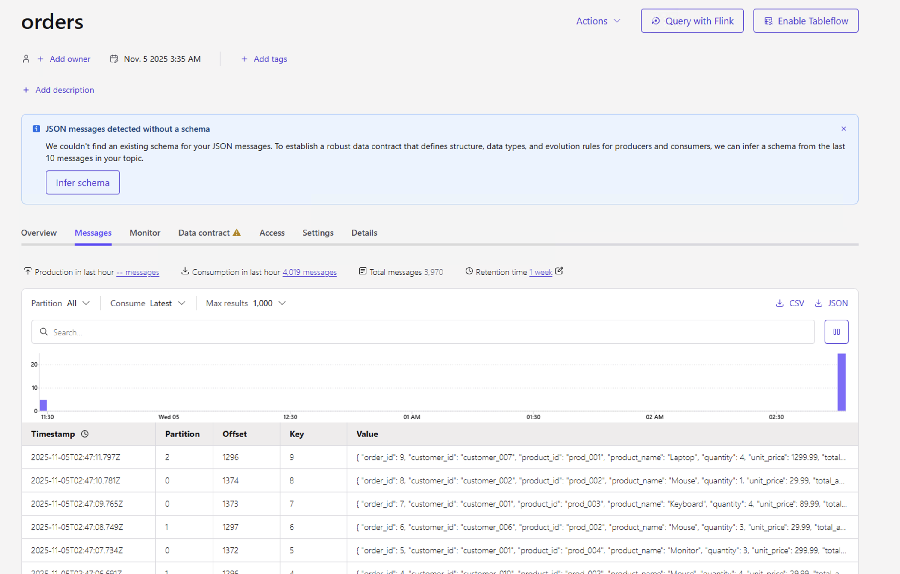

## Part 3 - Provision Migration Resources with KCP CLI

In this section, you will use the Confluent KCP CLI to provision all necessary migration infrastructure and establish a Cluster Link between MSK and Confluent Cloud. 

Creating all of the required infrastructure manually can be complex and time consuming. Luckily, the KCP CLI automates creation of all of the infrastructure and networking components with a few commands.

### Requirements

Complete [Part 2: Set Up and Test Client Applications](../PART-2/README.md) before starting Part 3. 

### Scan your AWS resources 
1. Navigate to your home directory on your bastion host: 
   ```bash
   cd ~/
   ```

2. Set the environment variables for your AWS role. Make sure to enter your own values for `<YOUR_AWS_ACCESS_KEY_ID>`, `<YOUR_AWS_SECRET_ACCESS_KEY>`, and `<YOUR_AWS_SESSION_TOKEN>`. 
    ```bash
    export AWS_ACCESS_KEY_ID="<YOUR_AWS_ACCESS_KEY_ID>"
    export AWS_SECRET_ACCESS_KEY="<YOUR_AWS_SECRET_ACCESS_KEY>"
    export AWS_SESSION_TOKEN="<YOUR_AWS_SESSION_TOKEN>"
    ```

3. Use the KCP CLI to scan your AWS region for Kafka resources and generate a report. If you changed the default region, you use the region where all of your workshop resources are deployed, for example, `us-west-2`: 
   ```bash
   kcp discover --region us-west-2
   ```

   This command generates two files (`kcp-state.json` and `cluster-credentials.yaml`) that contain information about your MSK resources in your chosen AWS region. You should see the a cluster called `msk-migration-cluster` in the output. Copy its `Cluster ARN` value for use in the next step. 

4. Add your cluster credentials to the `cluster-credentials.yaml` file. 
   ```bash
   nano cluster-credentials.yaml
   ```

   Enter the MSK cluster SASL username ("msk-user") and password ("ChangeMe123!") into the appropriate fields in the `cluster-credentials.yaml` file and save it. 

5. Use the KCP CLI to perform a cluster-level scan on your source cluster: 
   ```bash
   kcp scan clusters \
   --state-file kcp-state.json \
   --credentials-file cluster-credentials.yaml
   ```

### Create the target infrastructure
1. Run the following command to create the target infrastructure Terraform. Make sure to substitute your own values where needed: 
   ```bash
   kcp create-asset target-infra \
   --state-file kcp-state.json \
   --cluster-arn <YOUR_CLUSTER_ARN> \
   --needs-environment true \
   --env-name target-env \
   --needs-cluster true \
   --cluster-name target-cluster \
   --cluster-type enterprise \
   --needs-private-link true \
   --subnet-cidrs "10.0.10.0/24","10.0.20.0/24","10.0.30.0/24"
   ```

   ```bash
   cd target_infra
   teraform init
   terraform apply
   ```

### Create the migration infrastructure 
1. Run the following command to create the migration infrastructure Terraform. Make sure to substitute your own values where needed: 
   ```bash 
   kcp create-asset migration-infra \
   --state-file kcp-state.json \
   --cluster-arn <YOUR_CLUSTER_ARN> \
   --type 2 \
   --target-environment-id <YOUR_ENV-ID> \
   --cluster-link-name msk-to-cc-link \
   --target-cluster-id <YOUR_CLUSTER_ID> \
   --target-rest-endpoint <YOUR_CLUSTER_REST_ENDPOINT>
   ```

2. Navigate to the newly-created `migration_infra` directory and create the infrastructure with terraform: 
   ```bash 
   cd migration-infra
   terraform init
   terraform apply --auto-approve
   ```

4. When prompted, enter your Confluent Cloud API Key details (f you don't have a Confluent Cloud API Key, see the [Workshop Introduction](../README.md) prerequisites) and SASL username ("msk-user") and password ("ChangeMe123!") for the MSK cluster. Terraform will begin deploying the necessary resources. 


5. After the terraform deployment completes successfully,you can navigate to the [Confluent Cloud Console](http://confluent.cloud/go/cluster) and view your newly-created target resources. 



6. Now you need to add the newly-created **credentials**, **Confluent Cloud bootstrap endpoint** to your `env.cc` file. You'll need to log into Confluent Cloud and view the new cluster to get this information. 

7. Navigate to your clients directory and update the `env.cc` file with the cluster API credentials:
   ```bash
   cd ~/clients
   nano env.cc
   ```

8. Replace the placeholder values in your `env.cc` file with the actual cluster API credentials from the terraform output:
   ```bash
   # Confluent Cloud Environment Configuration
   export KAFKA_ENV=cc
   export CC_BOOTSTRAP_SERVERS="<BOOTSTRAP_SERVER_ENDPOINT>"
   export CC_API_KEY="<CLUSTER_API_KEY>"
   export CC_API_SECRET="<CLUSTER_API_SECRET>"
   ```

### Create the mirror topics
1. Run the following command to create the mirror topics: 
   ```bash
   cd ~/
   ```

   ```bash
   kcp create-asset migrate-topics \
   --state-file kcp-state.json \
   --cluster-arn <YOUR_CLUSTER_ARN> \
   --target-cluster-id <YOUR_CLUSTER_ID> \
   --target-cluster-rest-endpoint <YOUR_CLUSTER_REST_ENDPOINT> \
   --target-cluster-link-name msk-to-cc-link
   ```

This creates mirror topics on your cluster link and begins data replication for migration. 

3. Navigate to the new `migrate_topics` folder:
   ```bash 
   cd migrate_topics
   terraform init 
   terraform apply 
   ```

3. You can now navigate to the **Topics** menu inside your cluster in Confluent Cloud and view your orders topic. 

   

   You may notice that topic information is currently limited for this privately-networked Enterprise Cluster. If you want to view more topic-specific details, you can use the Windows bastion host in the next section for a more granular view. 

### [Optional] View messages in Confluent Cloud Topics UI
Because the Enterprise cluster is private, to view messages in the Topics UI you need to access the Topics UI via a Windows bastion host. Please perform the following steps from your laptop — **not directly on the bastion host**.

1. Get the Windows bastion host details: Run the following command:

   ```
   terraform output windows_bastion_ip
   terraform output windows_bastion_password
   terraform output windows_bastion_username
   ```

2. RDP to the Source (AWS) Bastion Host.

3. In the [Topics UI](https://confluent.cloud/go/topics), select the destination environment and cluster.

4. Verify mirrored topics appear in your Enterprise cluster.
   


### Next Steps 

With the help of the KCP CLI, you've now created the entire migration infrastructure and the target Confluent Cloud Enterprise cluster. You also established the Cluster Link to begin topic mirroring from your MSK Cluster to your Confluent Cloud Enterprise Cluster. In the next section, you will cut over your client applications to use the new Confluent Cloud cluster, completing the migration. 

## Topics

**Next topic:** [Part 4: Cutover Client Applications to Confluent Cloud](../PART-4/README.md)

**Previous topic:** [Part 2: Set Up and Test Client Applications](../PART-2/README.md)
