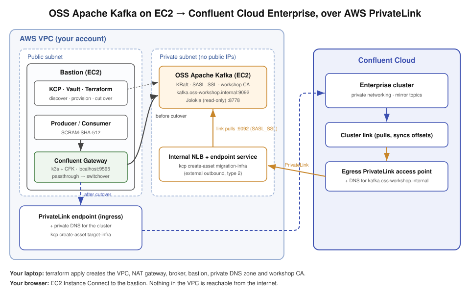

# Migrating from Open-Source Apache Kafka to Confluent Cloud

This workshop walks through a **zero-cut migration** from a self-managed, open-source Apache
Kafka cluster running on **Amazon EC2** to a **Confluent Cloud Enterprise cluster**. 

It is the self-managed sibling of the
[hosted-kafka-to-enterprise-migration](../hosted-kafka-to-enterprise-migration) (Amazon MSK)
workshop and uses the same tooling:

- **KCP** discovers the source cluster, generates the Terraform for the Enterprise cluster, the
  PrivateLink networking, the cluster link and the mirror topics, and drives the cutover. See
  the [KCP documentation](https://confluentinc.github.io/kcp).
- **Cluster Linking** mirrors topics byte-for-byte and syncs consumer offsets, so there are no
  duplicate or missing messages during the migration.
- **Gateway** gives clients one stable endpoint for the whole migration and flips traffic from
  OSS Kafka to Confluent Cloud without any client restart or reconfiguration.

## Workshop

> Estimated time: ~90 minutes.

- [Step 0: Setup](./STEP-0-SETUP/README.md) — deploy the AWS source environment, deploy the Gateway, run clients through it
- [Step 1: Discover and Plan](./STEP-1-DISCOVER/README.md) — scan the source cluster and its metrics with KCP
- [Step 2: Provision Infrastructure](./STEP-2-PROVISION/README.md) — create the Enterprise cluster, the private cluster link, and the Gateway target with KCP
- [Step 3: Migrate Data](./STEP-3-MIGRATE-DATA/README.md) — create mirror topics and replicate
- [Step 4: Migrate Clients](./STEP-4-MIGRATE-CLIENTS/README.md) — execute the zero-cut cutover
- [Step 5: Cleanup Resources](./STEP-5-CLEANUP/README.md) — tear everything down

## Topics

**Next topic:** [Step 0: Setup](./STEP-0-SETUP/README.md)
